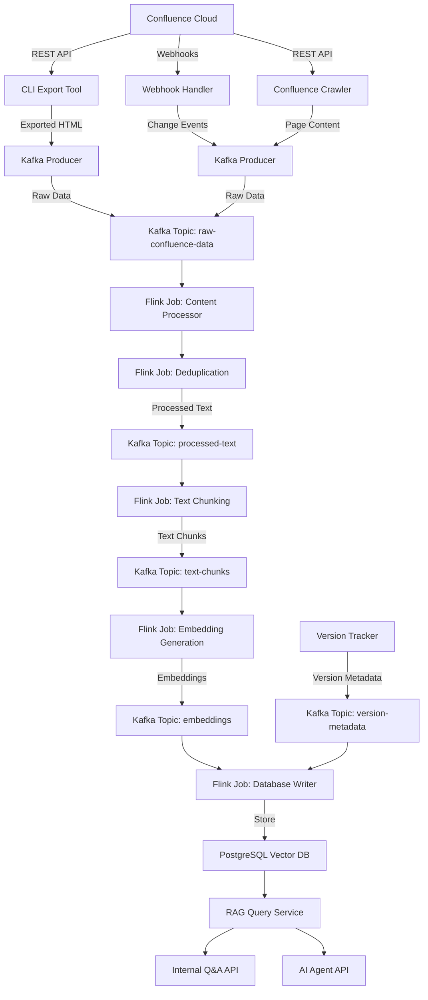

# ADR 001: Confluence Knowledge Base for RAG System Architecture

## Status
Proposed

## Context
We need to create a knowledge base for a RAG system that can retrieve information from Confluence. The system needs to handle large volumes of Confluence data with high throughput, track versions of content, and support both automated crawling and on-demand exports via a CLI tool.

## Decision
We will implement a streaming data pipeline using Kafka and Flink to process Confluence content, with PostgreSQL (with pgvector extension) as the vector database. The system will include direct integration with Confluence Cloud via webhooks and REST API, as well as a CLI tool for on-demand exports.

## Architecture

### 1. System Architecture



### 2. Dual-Source Content Handling

#### 2.1 CLI Export Tool

1. **Functionality**
   - Command-line interface for exporting Confluence content
   - Support for exporting by URL, page ID, or space key
   - Options for exporting single pages or entire spaces
   - Authentication handling for Confluence API access

2. **Usage Examples**
   ```bash
   # Export a single page by URL
   confluence-export --url "https://yourcompany.atlassian.net/wiki/spaces/SPACE/pages/123456"
   
   # Export an entire space
   confluence-export --space "SPACE"
   
   # Export with custom output location
   confluence-export --url "..." --output "./exports"
   ```

3. **Export Processing**
   - Convert Confluence content to standardized HTML format
   - Extract and preserve metadata (page ID, version, author, etc.)
   - Include source markers to identify CLI-exported content
   - Direct integration with Kafka producer for streamlined processing

#### 2.2 Deduplication Strategy

1. **Content Matching**
   - Identify potential duplicates using:
     - Page title and space information
     - Content similarity hashing
     - Metadata comparison
   - Track source of each content item (API vs CLI export)

2. **Priority Rules**
   - Always prioritize CLI-exported pages over automatically crawled content
   - Implement source tracking in database schema
   - Add source and priority flags to content metadata

3. **Conflict Resolution**
   - When duplicate content is detected:
     - Keep the CLI-exported version
     - Update metadata to reflect both sources
     - Log the conflict for auditing
   - Implement version history that tracks both sources

#### 2.3 Flink Deduplication Job

1. **Job Implementation**
   - Dedicated Flink job for deduplication
   - Stateful processing to track known content
   - Window-based processing to handle near-simultaneous updates

2. **Processing Logic**
   - Compare incoming content with existing database entries
   - Apply priority rules for conflict resolution
   - Generate appropriate update or insert operations
   - Track lineage of content across sources

### 3. Database Schema

```
- documents (
    id, 
    title, 
    url, 
    space, 
    version, 
    source_type,       # 'auto' or 'manual'
    source_priority,   # priority level for conflict resolution
    content_hash,      # for deduplication
    created_at, 
    updated_at
  )
- chunks (
    id, 
    document_id, 
    content, 
    embedding, 
    chunk_index, 
    version_id,
    source_type        # inherited from document
  )
- versions (
    id, 
    document_id, 
    version_number, 
    source_type,       # 'auto' or 'manual'
    timestamp, 
    hash
  )
- source_mappings (
    id,
    document_id,
    confluence_page_id,  # ID in Confluence API
    source_type,         # 'auto' or 'manual'
    last_update_time
  )
```

### 4. Implementation Phases

#### Phase 1: Infrastructure & Dual-Source Integration
- Set up Kafka and Flink infrastructure
- Implement Confluence webhook handler and API crawler
- Develop CLI export tool
- Implement content identification and matching

#### Phase 2: Deduplication & Processing Pipeline
- Develop deduplication Flink job
- Implement content processing jobs
- Set up version tracking with source awareness
- Test with mixed sources of content

#### Phase 3: Embedding & Storage
- Develop embedding generation pipeline
- Implement database schema with source tracking
- Optimize storage and retrieval for deduplicated content
- Test end-to-end pipeline

#### Phase 4: RAG & API Development
- Implement query service with source awareness
- Develop response generation
- Create API interfaces
- Integrate with AI agents

#### Phase 5: Testing & Optimization
- Performance testing with mixed content sources
- Optimize deduplication logic
- Implement monitoring and alerting
- Documentation and handover

### 5. Development Environment

#### 5.1 Docker Compose Setup

We will use Docker Compose to create a consistent development environment that includes all required infrastructure components. This approach ensures that all developers can quickly set up the complete system with minimal configuration.

1. **Components**
   - Zookeeper - Required by Kafka for coordination
   - Kafka - Message broker for the streaming pipeline
   - Confluent Control Center - Comprehensive management UI for Kafka
   - Flink JobManager - Coordinates Flink jobs
   - Flink TaskManager - Executes Flink tasks
   - PostgreSQL with pgvector - Vector database for embeddings
   - PgAdmin - Web interface for PostgreSQL management

2. **Configuration**
   - All services are configured with sensible defaults for development
   - Persistent volumes for data storage
   - Health checks to ensure service availability
   - Exposed ports for local development access

3. **Usage**
   ```bash
   # Start the development environment
   docker compose up -d
   
   # View logs
   docker compose logs -f [service]
   
   # Stop the environment
   docker compose down
   
   # Stop and remove volumes
   docker compose down -v
   ```

4. **Integration with Local Development**
   - Local code connects to containerized services
   - Environment variables in `.env` file configure connection details
   - Automatic topic creation in Kafka
   - Database initialization scripts for PostgreSQL

### 6. CLI Export Guidelines

1. **Export Options**
   - Support for various export formats
   - Configurable export depth (single page, hierarchy, entire space)
   - Options for including comments, attachments, etc.
   - Batch export capabilities

2. **Metadata Handling**
   - Automatic extraction of Confluence metadata
   - Custom metadata inclusion options
   - Preservation of page relationships and hierarchy

3. **Integration with Pipeline**
   - Direct submission to Kafka pipeline
   - Local caching options for offline exports
   - Batch processing mode for large exports

### 7. Additional Considerations

#### 6.1 Content Versioning with Dual Sources

1. **Version History**
   - Track separate version histories for each source
   - Maintain unified timeline with source indicators
   - Support viewing content from specific source/version

2. **Audit Trail**
   - Log all source conflicts and resolution decisions
   - Track which source was used for each chunk in the knowledge base
   - Support rollback to previous versions from either source

#### 6.2 Performance Optimization

1. **Efficient Deduplication**
   - Bloom filters for fast duplicate detection
   - Incremental content hashing
   - Parallel comparison for large volumes

2. **Batch Processing**
   - Optimize for bulk CLI exports
   - Efficient batch updates to database
   - Parallel processing of independent content

## Consequences

### Positive
- High-throughput processing of Confluence content
- Flexible content sourcing (automatic crawling and CLI exports)
- Robust deduplication with clear priority rules
- Scalable architecture that can handle large volumes of data
- Version tracking for all content

### Negative
- Complex infrastructure requiring Kafka and Flink expertise
- Potential challenges with Confluence API rate limits
- Need for careful management of duplicate content
- Higher operational complexity compared to simpler solutions

## References
- Kafka documentation: https://kafka.apache.org/documentation/
- Flink documentation: https://flink.apache.org/docs/stable/
- pgvector extension: https://github.com/pgvector/pgvector
- Confluence Cloud REST API: https://developer.atlassian.com/cloud/confluence/rest/
- Docker Compose documentation: https://docs.docker.com/compose/